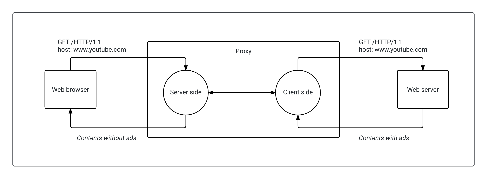

# system-adblock

The aim of this project is to develop a similar program to ad blockers in web browsers. We have to program a proxy in C language which will analyze incoming traffic and removes suspicious contents that are advertisements. This project is developed in the context of the course about advanced networks and systems teached at TELECOM Nancy.

## Project structure

- build: Contains all object files generated by the compiler.
- include: All header files.
- src: Contains the application’s source files.

## Installation

    git clone git@github.com:quentin-tardivon/system-adblock.git
    make
    ./adblock

    # If you want to specify the port to use
    ./adblock --port=3141

On linux, there is some restrictions with on chromium web browser, you have to use the following command line to tell the browser the proxy to use:

    # chromium
    chromium-browser --proxy-server="127.0.0.1:3141"

## License

See the [LICENCE file !](https://github.com/quentin-tardivon/system-adblock/blob/master/LICENSE)

## Authors

[@quentin-tardivon](https://github.com/quentin-tardivon), Quentin Tardivon

[@mcdostone](https://github.com/mcdostone), Yann Prono
