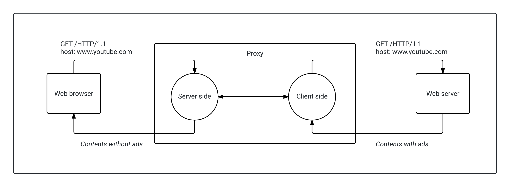

# system-adblock

The aim of this project is to develop a similar program to ad blockers in web browsers. We have to program a proxy in C language which will analyze incoming traffic and removes suspicious contents that are advertisements. This project is developed in the context of the course about advanced networks and systems teached at TELECOM Nancy.

## Project structure

- build: Contains all object files generated by the compiler.
- include: All header files.
- src: Contains the application’s source files.

## Installation

    git clone git@github.com:quentin-tardivon/system-adblock.git
    make
    ./adblock

    # If you want to specify the port to use
    ./adblock --port=3141

On linux, there is some restrictions with the chromium web browser, you have to use the following command line to tell the browser the proxy to use:

    # chromium, not working if there is already the program running
    chromium-browser --proxy-server="127.0.0.1:3141"

It's very boring to change every compilation, the proxy of your web browser, just run the following:

    # execute ./adblock and 'curl 01net.com'
    # DEBUG=1 enables to print more things during the execution
    make test DEBUG=1

## Observations

- On firefox dev edition, there is some special characters at the end of some requests, don't know what it is!

      POST http://ocsp.digicert.com/ HTTP/1.1
      Host: ocsp.digicert.com
      User-Agent: Mozilla/5.0 (X11; Ubuntu; Linux x86_64; rv:54.0) Gecko/20100101 Firefox/54.0
      Accept: text/html,application/xhtml+xml,application/xml;q=0.9,*/*;q=0.8
      Accept-Language: en-US,en;q=0.5
      Accept-Encoding: gzip, deflate
      Content-Length: 83
      Content-Type: application/ocsp-request
      Connection: keep-alive

      0Q0O0M0K0I0	+

- Sockets communications are established. On small websites (example.com), the proxy works fine. But on big websites like 01net.com, Some contents miss in the web broswer. In consequence, a lot of requests which depends on HTML page (CSS, JS, ...) are not loaded. I think that the fix should be done in [client.c: get_http_response(...)](https://github.com/quentin-tardivon/system-adblock/blob/master/src/client.c#L54)

## License

See the [LICENCE file !](https://github.com/quentin-tardivon/system-adblock/blob/master/LICENSE)

## Authors

[@quentin-tardivon](https://github.com/quentin-tardivon), Quentin Tardivon

[@mcdostone](https://github.com/mcdostone), Yann Prono
